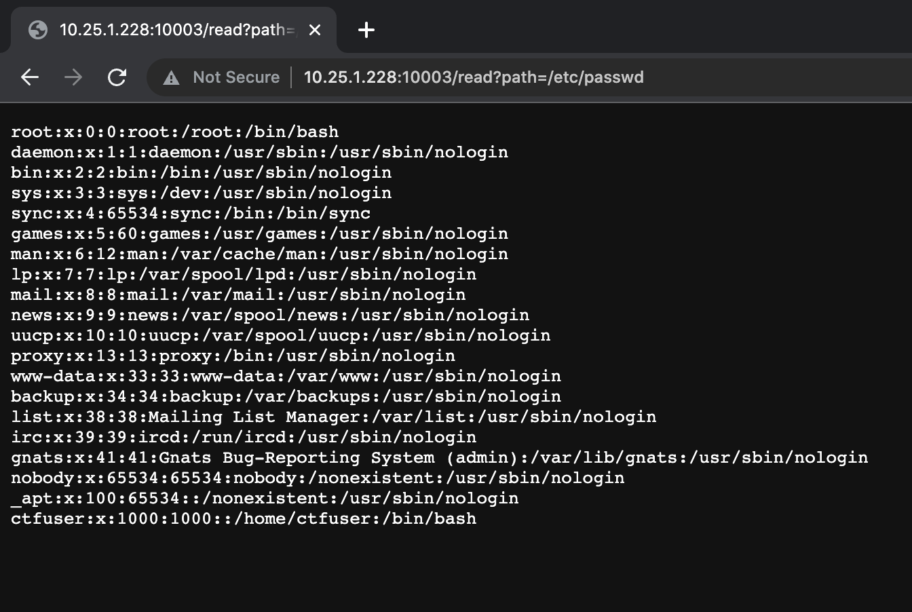
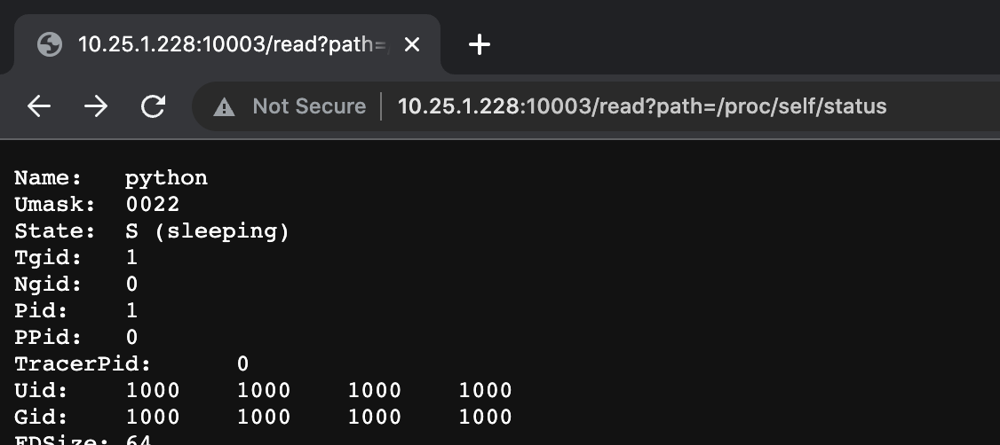
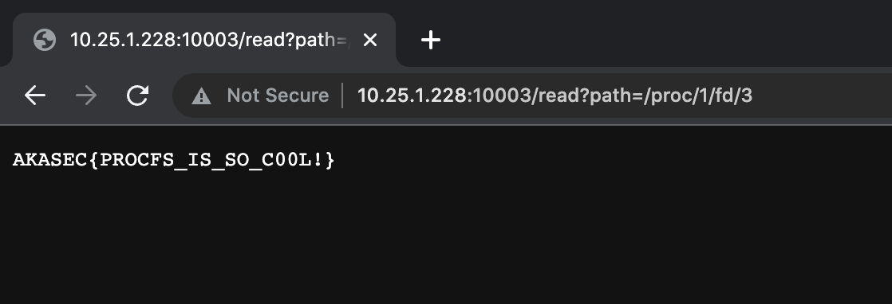

# UM6P_Quals

## ChallengeName: Grasp


<strong>challenge discription</strong>


<h3>visiting the challenge on browser</h3>


<h3>Let's check the source code</h3>

```python
@app.get('/read')
def read_file():
    file = request.args.get("path")
    if file:
        try:
            return Response(open(file, 'r').read().strip(), mimetype='text/plain')
        except FileNotFoundError:
            return "file not found."
        except OSError:
            return "something went wrong!"
    else:
        return 'i bet this so called hackers think they have an LFI and they can just read the flag, guess what i deleted it!<br><br></img>'
```
<h4>
On <strong>/read</strong> indpoint

It's simply take an argument <strong>path</strong>

and pass it to <strong>open</strong> read the the file content and get response back

So it's an <strong>Arbitrary File Read</strong> Vulnerability

Trying to read /etc/passwd
</h4>




<h4>
The problem is we can't read <strong>flag.txt</strong>
because it's deleted at when the server start
</h4>

```python
if __name__ == "__main__":
    file = open(flag_path, 'r')
    print(f"just for you admin, here is the flag: {file.read().strip()}")
    os.remove(flag_path) # totally gone
    app.run("0.0.0.0", 3000)
```

<h4>
After some useless enumiration I can't find the <strong>flag</strong> anywhere else

so I back again to source code there flag opend then it deleted
</h4>

```python
    flag_path = "/app/flag.txt"
    .
    .
    .
    file = open(flag_path, 'r')
```

I<h4>I already Got some information about the current proccess when I was enumirating.</h4>




<h4>Like <strong>Pid:1</strong>

Which was so interesting for me because in unix once you have <strong>Pid</strong> of a proccess<br/>
then you can access all data all files discriptors that is opend with that proccess and this is what we want<br/>
The syntax to access a file descriptors of a proccess is <pre>/proc/[Pid]/fd/[number of fd]</pre><br/>
Since the file discriptor 0 1 and 2 are reserved by the system stdin stdout stderr<br/>
we will check the file discriptor 3
</h4>




<hr/>
<h2>The flag  <strong>AKASEC{PROCFS_IS_SO_C00L!}</strong></h2>

<hr/>
<h3>Resources</h3>
<a href='https://en.wikipedia.org/wiki/Procfs'>https://en.wikipedia.org/wiki/Procfs</a>